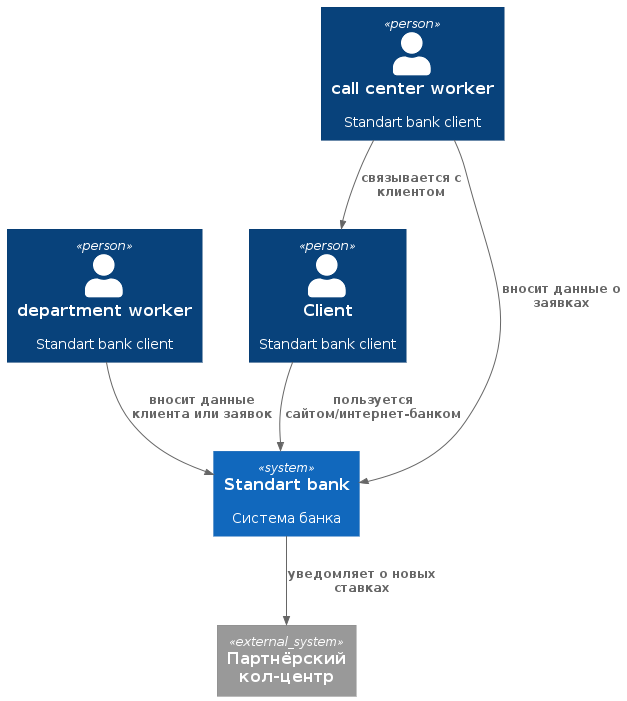
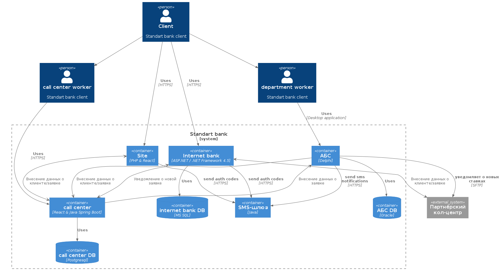

### **Название задачи:** 
### **Автор:**
### **Дата:**
### **Функциональные требования**
Опишите здесь верхнеуровневые Use Cases. Их нужно оформить в виде таблицы с пошаговым описанием:

|**№**|**Действующие лица или системы**|**Use Case**|**Описание**|
| :-: | :- | :- | :- |
| 1 | сотрудник колцентра(в том числе партнерского), менеджер отделения, клиент | Регистрация нового клиента | 1) клиент регистрируется на сайте 2) подтверждает номер телефона через смс 3) заявка добавляется в АБС 4) сотрудник колцентра(в том числе партнерского) звонит новому клиенту и назначает дату и время для подтверждение личности в офисе 5) менеджер отделения подтверждает личность |
| 2 | сотрудник колцентра(в том числе партнерского), менеджер отделения, клиент | Оформление депозита | 1) выбирает депозит на сайте/интернет-банке 2) клиент вводит номер счёта и сумму, и отправляет заявку 3) подтверждает личность через смс код 4) заявка добавляется в АБС 5) сотрудник колцентра(в том числе партнерского) звонит клиенту и назначает дату и время для оформления депозита в офисе 5) клиент получает услугу в отделении |
| 3 | сотрудник колцентра(в том числе партнерского), менеджер отделения, клиент | Оформление кредита | 1) клиент ознакамливается с персональными условиями кредита на сайте/интернет-банке 2) если условия устраивают отправляет заявку 3) подтверждает личность через смс код 4) заявка добавляется в АБС 5) сотрудник колцентра(в том числе партнерского) звонит клиенту и назначает дату и время для оформления кредита в офисе 5) клиент получает услугу в отделении |
|||||
### **Нефункциональные требования**
Опишите здесь нефункциональные требования и архитектурно значимые требования.

|**№**|**Требование**|
| :-: | :- |
| 1 | Передача данных между сайтом, интернет-банком и новыми сервисами должна выполняться по защищённым каналам (TLS/HTTPS). |
| 2 | Для MVP допускается ручная обработка заявок бэк-офисом, но архитектура должна поддерживать дальнейшую автоматизацию. |
| 3 | Система должна поддерживать быстрое взаимодействие в пользовательских сценариях. |
| 4 | Решение должно использовать существующие технологии и компетенции банка там, где это снижает риски: Oracle, MS SQL, Java, .NET, React, PHP. |
| 5 | Функциональность подтверждения операций по SMS должна быть реализована без доработки ядра интернет-банка подрядчиком; предпочтительно вынести её в отдельный сервис банка. |
| 6 | Ставки по депозитам должны быть вынесены из XLS в централизованный реестр с управляемым доступом для депозитного и кредитного бэк-офиса. |
| 7 | Решение должно поддерживать балансировку нагрузки между серверами/ЦОД. |
| 8 | У АБС сохраняется ограничение вертикального масштабирования из-за Oracle/PL-SQL архитектуры. |
| 9 | Архитектура должна быть документирована и понятна для дальнейшего расширения на другие продукты и сценарии. |
| 10 | Пользовательские интерфейсы сайта и интернет-банка должны соответствовать корпоративной дизайн-системе банка. |
| 11 | Для новых клиентов сайт не должен открывать депозит полностью онлайн: обязательна идентификация в отделении. |
| 12 | Требования 24/7 и 99,9% являются целевыми для нового сервисного слоя. |
| 13 | Новые сервисы должны проектироваться так, чтобы на следующем этапе можно было перейти к полноценной событийной интеграции, включая Kafka, без полной переработки решения. |
| 14 | Кол-центр банка должен иметь доступ к актуальным ставкам что бы консультировать клиентов. |
| 15 | Передача данных об актуальных ставках в партнёрский кол-центр должна осуществляться в виде передачи файлов. |
### **Решение**

#### Context

#### Container

Архитектура MVP разработана с учётом существующего IT-ландшафта банка и архитектурно-значимых требований.

Основной принцип — минимальные изменения существующих систем и использование уже внедрённых технологий. Это снижает риски внедрения и ускоряет реализацию MVP.

Использование существующих систем

Для реализации процесса открытия депозитов используются текущие системы банка:

- Сайт (PHP + React) — для подачи заявки новыми клиентами.

- Интернет-банк (ASP.NET / .NET Framework + MS SQL) — для подачи заявки действующими клиентами.

- Система кол-центра (React + Java Spring Boot + PostgreSQL) — для обработки заявок клиентов.

- Партнёрский кол-центр — для помощи кол-центру банка в случае высоких нагрузок.

- АБС (Delphi + Oracle) — основная система оформления депозитов.

- SMS-шлюз — для подтверждения операций и отправки уведомлений.

АБС остаётся system of record для депозитных продуктов.

#### Минимизация нагрузки на АБС

База данных АБС уже перегружена, поэтому архитектура построена так, чтобы:

- интернет-банк и сайт не создавали дополнительную онлайн-нагрузку на АБС;

- заявки сначала обрабатывались через кол-центр и бэк-офис.

Это соответствует текущему процессу и снижает риски для основной банковской системы.

#### Безопасность

Передача данных между системами выполняется через HTTPS, что обеспечивает защиту персональных данных клиентов.

SMS-подтверждение используется для подтверждения операций в интернет-банке.

Передача данных об актуальных ставках в партнёрский колл-центр должна осуществлять по протоколу SFTP.

#### Производительность

Интернет-банк и сайт работают независимо от АБС, что позволяет:

- обеспечивать быстрый отклик интерфейсов;

- избегать задержек из-за медленных операций в АБС.

#### Участие команд

В реализации MVP участвуют следующие команды:

- команда интернет-банка — интерфейс и логика подачи заявки;

- команда сайта — форма заявки для новых клиентов;

- команда АБС — оформление депозитов;

- команда кол-центра — обработка заявок;

- команда партнёрский кол-центр — обработка заявок;

- команда инфраструктуры — SMS-шлюз и безопасность.

### **Альтернативы**
1. Полная автоматизация процесса уже в MVP

**Идея:** сразу отказаться от участия бэк-офиса и автоматически открывать депозит после подачи заявки.
**Почему не выбрано:** текущие процессы расчёта и согласования ставок ещё завязаны на ручную работу и Excel, поэтому для MVP выбран более реалистичный и менее рискованный вариант.

2. Внедрение полноценной микросервисной платформы с Kafka

**Идея:** сразу построить целевую событийную архитектуру с отдельными сервисами и очередями сообщений.
**Почему не выбрано:** это увеличивает сроки, стоимость и сложность MVP. Кроме того, текущая версия интернет-банка несовместима с Kafka без дополнительных доработок.

3. Сохранение работы со ставками только в Excel

**Идея:** не менять текущий процесс ведения ставок.
**Почему не выбрано:** Excel не подходит как надёжный источник данных для цифровых каналов, не обеспечивает прозрачность, совместную работу и дальнейшее масштабирование решения.

3. Общение с ситемой парнёрского кол-центра по HTTP(s)

**Идея:** Отправлять данные об актуальных ставках по HTTP (например с помощью Websocket).
**Почему не выбрано:** Из-за технических ограничений системы партнёрского кол-центра.

### **Недостатки, ограничения, риски**

Основным узким горлышком системы может быть АБС, так как он является ядром всем системы (единая точка отказа) и не поддерживает горизонтальное масштабирование из-за особенностей БД. Рекомендуется в будущем переписать АБС, так что бы текущие недостатки были устранены.

